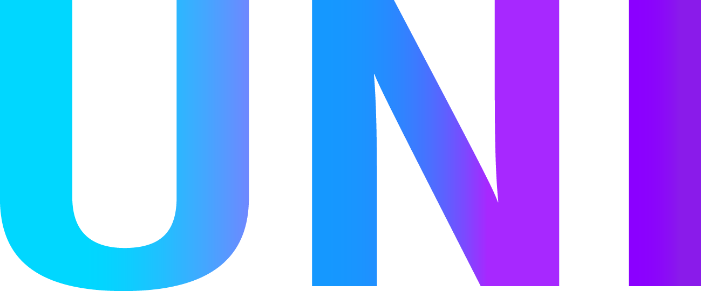

<p align="center"><a href="https://github.com/UN1Team/unispace"></a></p><br/>
<p align="center">
  <a href=""></a>
  <a href="https://vk.com/un1teamgroup"></a>
  <a href="https://discord.gg/wj6wZfrXBt"></a>
  <a href="http://unispace.ai-info.ru"></a>
  <a href="https://urfume-my.sharepoint.com/:w:/g/personal/dmitry_oplachko_urfu_me/EUW1X6HNkz9Pqter_1h0Z34B0R4SnIIM_Rzbat9QolRXVg?e=kl60xC"></a>
<a href="https://urfume-my.sharepoint.com/:p:/g/personal/dmitry_oplachko_urfu_me/EWo4Orjsw4hDv8IKbX12GlEBjS04Kd535xR7WtMBPbm9vg?e=TNe5XP"></a>
 </p>

<p align="center">
  <sub>
    1С21S.C.02. UN1Team. Сервис для информирования студентов об онлайн-курсах и заданиях
    <br>
    Учебный проект в рамках дисциплины "Проектный практикум", УрФУ, 2021 год
  </sub>
  <h1 align="center"> UNIspace </h1>
</p>

<h3 align="center"> Команда: UN1Team </h1>
<p align="center"> 
  рабочий стол студента
</p>

## Цель проекта
Создать сервис, который помогает студенту получать актуальную информацию о различных задачах и их сроках, извлекая её из всевозможных источников

> Формат приложения - Веб-сервис

## Описание:
   Веб-сервис, который взаимодействует с api различных платформ (VK, Telegram),
   чтобы собирать, аггрегировать и структурированно выдавать актуальную информацию о заданиях и онлайн-курсах

## Целевая аудитория:
   Студенты 1-го курса ИРИТ-РТФ, обучающиеся по индивидуальным образовательным траекториям (ИОТ)

## Основное преимущество:
   - Информирование каждого студента в индивидуальном порядке, что больше подходит *(как мы считаем)* для концепции ИОТ.
   - Быстрый доступ к информации экономит время студентов, не нужно пролистывать множество бесед.
   - Снижается вероятность пропустить информацию о важном задании, которое оказыват влияние на оценку. Повышение успеваемости студентов.

## Технологический cтек продукта / MVP:
   GNU/Linux - Ngnix - PostgreSQL - PHP - Laravel

## Алгоритм работы с MVP:
   Перейдите в наше <a href="https://vk.com/un1teamgroup">сообщество ВК</a>
   <br>
   Там будут подробное описание, как работать с ботом.

## MVP:
   - Построено веб-приложение на фреймворке Laravel с нужными модулями
   - Реализовано базовое взаимодействие с vk api
   - Реализована запись/чтение данных с базы посредством vk бота

## Основные требования:
   - Любой браузер, который может открывать [ВК](https://vk.com)
   - Аккаут в [ВК](https://vk.com)

<!--
## Основные требования:
   - [Apache HTTP server](https://httpd.apache.org/) или [NGNIX](https://www.nginx.com/) любой версии
   - [PostgreSQL v9.x.x и выше](https://www.postgresql.org/)
   - [PHP v7.x и выше](https://www.php.net/)
   - [Composer v2.x и выше](https://getcomposer.org/)
   - [Laravel v8.x и выше](https://laravel.com)
-->

<!-- ## Порядок установки:
  1. Склонировать репозиторий
 ```sh
  $ git clone https://github.com/UN1Team/unispace.git
 ```
  2. Перейти в папку с исходным кодом
  ```sh
  $ cd unispace/src/
 ```
  3. Установить зависимости composer
  ```sh
  $ composer install
 ```
  4. Установить зависимости npm
  ```sh
  $ npm install
  ```
  Или, используя yarn:
  ```sh
  $ yarn
  ```
  5. Создайте файл .env из .env.example
  ```sh
  $ cp .env.example .env
  ```
  6. Сгенерируйте ваш ключ шифрования -->

## Структура приложения:

 ./src - исходный код проекта
  <br>
 ./README.MD - этот файл README
  <br>
 ./LICENSE.MD - файл с лицензией
  <br>
 ./report.docx - отчёт по проекту
